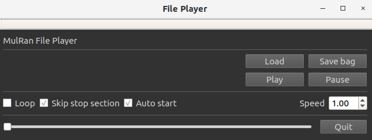

# file_player_common
This program is a common file player for the rosbag, which is modified based on [file_player_mulran](https://github.com/irapkaist/file_player_mulran). 

Video: [file_player_common demo](https://www.bilibili.com/video/BV1Bm4y177iC/?spm_id_from=333.1007.0.0&vd_source=fb7f82fee1e57e882c6174174ad2fa11)

## Features
- This player can load rosbag files and modify playback speed, pause and other operations;

- Support Livox lidar custom messages type;

- Support compressed image data.

## How to use
1. Compile the source
  ```
    mkdir -p ~/catkin_ws/src
    cd ~/catkin_ws/src
    git clone https://github.com/YJZLuckyBoy/file_player_common
    cd ..
    catkin_make -j8

    # If you want to load Livox lidar custom data types, you need to use the following
    mkdir -p ~/catkin_ws/src
    cd ~/catkin_ws/src
    git clone https://github.com/YJZLuckyBoy/file_player_common
    git clone https://github.com/Livox-SDK/livox_ros_driver.git
    cd ..
    catkin_make -DCOMPILE_LIVOX=TRUE -j8
  ```
2. Modify yaml file

If you want to use file_player_common plays rosbag files with different topic, you only need to modify the "topic.yaml" file in the config folder.
  ```
    topic_name:
      lidar_topic  : "/points_raw"                    # lidar topic, The data type must be sensor_msgs::PointCloud2 or livox_ros_driver::CustomMsg
      imu_topic    : "/imu_raw"                       # imu topic, The data type must be sensor_msgs::Imu
      gps_topic    : "/nav_sat_fix"                   # gps topic , The data type must be sensor_msgs::NavSatFix
      camera_topic : "/camera/image_color/compressed" # camera topic , The data type must be sensor_msgs::Image or sensor_msgs::CompressedImage
  ```

3. Run the launch file
  ```
    roslaunch file_player_common file_player_common.launch
  ```

## Acknowledgments
  Thanks for [file_player_mulran](https://github.com/irapkaist/file_player_mulran).

# File player for MulRan dataset

Maintainer: Giseop Kim (paulgkim@kaist.ac.kr)

This program is a file player for the [MulRan dataset](https://sites.google.com/view/mulran-pr/home). 

## NEWS

### Update (2021. 08. 03): rosbag generation 
- We now support to generate a rosbag from the files. This is a contribution from [Daniel Adolfsson](https://github.com/dan11003) and we are very grateful for his efforts (for the details: see [The pull requests from @dan11003](https://github.com/irapkaist/file_player_mulran/pull/7))
- Use the 'Save bag' button. <p align="center"></p>
- Note
  - Currently only Radar files are saved into a rosbag with ground-truth trajectory (not body frame, but UTM coordinate) as Odometry topic. Later, we plan to support lidar, imu, and gps topics as well as the radar files in a single rosbag.


### Update (2020. 11. 19): IMU and GPS are available 
- We released IMU and GPS data (consumer-level), as well as the originally delivered LiDAR and radar data. 
  - The model specification and the extrinsic calibration (i.e., the sensor position within our car platform) is equivalent to our lab's other dataset ([Complex Urban Dataset, IJRR 19](https://irap.kaist.ac.kr/dataset/)), so please refer the paper. 
- We expect these data supports [GPS-aided radar researches](https://arxiv.org/pdf/2006.02108.pdf), LiDAR-IMU fusion such as [LIO-SAM](https://github.com/TixiaoShan/LIO-SAM) ([example video](https://youtu.be/Y6DXlC34qlc?t=479)), or radar-imu fusion.

## How to use 

```
$ cd ~/catkin_ws
$ catkin_make
$ source devel/setup.bash
$ roslaunch file_player file_player.launch
```
- Then, you need to select a sequence directory via GUI.
- For the correct load, first you need to place the GPS, IMU, LiDAR, and radar files in a directory following this structure (see this [guide video](https://youtu.be/uU-FC-GmHXA?t=45)) 
- IMU and GPS files (.csv) must be located at the same directory of "data_stamp.csv"


## Contributors
- Jinyong Jeong: The original author
- Minwoo Jung: made the player system compatible with LIO-SAM input (i.e., supports ring information of a lidar scan)
 
